# Tailwind Traders - Point of Sale Legacy Migration to Azure

## This repo is now archived, so there will be no additional work done here. We still encorage folks to check out the content to learn more about modernizing your legacy applicaitons to Azure. 

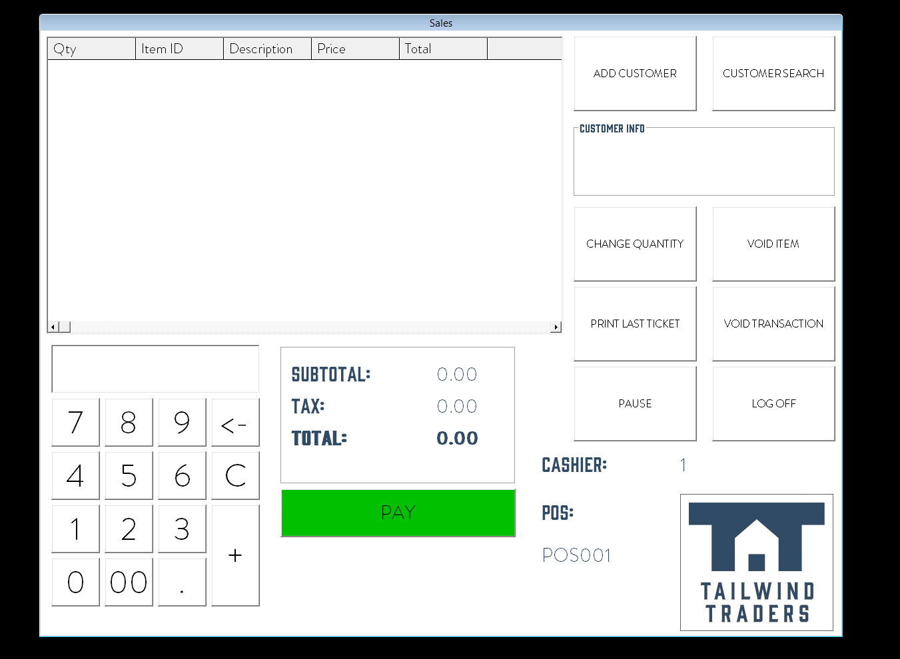

Check out the live website: [https://pos.tailwindtraders.com](https://pos.tailwindtraders.com)

Tailwind Traders business has technology at its heart. It blends the ease of online shopping with the familiarity of a mom-n-pop corner hardware store, and is quickly making a name for itself in the relatively new virtual hardware market. Like many modern organizations, it has evolving internal and external technology needs, and it approaches each moment of transformation with confidence.

Some of its important assets however are starting to age. This repository shows the example of a retail store Point of Sale (POS) application written in VB6 using an Access database and how it is migrated to ASP.NET and deploy to Azure using [Mobilize.net](https://www.mobilize.net) Microsoft's Partner solution.

> Note: This app uses backend services detailed in the [Backend](https://github.com/Microsoft/TailwindTraders-Backend) repository.

## Table of content

- [New to Microsoft Azure?](#new-to-microsoft-azure)
- [Repositories](#repositories)
- [Resources](#resources)
- [Migrations Tutorials](#migrations-tutorials)
  - [VB6 to WinForms](#VB6-to-WinForms)
  - [WinForms To Web](#WinForms-To-Web)
- [About Mobilize.net](#About-MobilizeNet)
- [Contributing](#contributing)

# New to Microsoft Azure?

You will need an Azure subscription to work with this demo code. You can:

- Open an account for free [Azure subscription](https://azure.microsoft.com/free/). You get credits that can be used to try out paid Azure services. Even after the credits are used up, you can keep the account and use free Azure services and features, such as the Web Apps feature in Azure App Service.
- [Activate Visual Studio subscriber benefits](https://azure.microsoft.com/pricing/member-offers/credit-for-visual-studio-subscribers/). Your Visual Studio subscription gives you credits every month that you can use for paid Azure services.
- Create an [Azure Student Account](https://azure.microsoft.com/free/students/) and get free credit when you create your account.

Learn more about it with [Microsoft Learn - Introduction to Azure](https://docs.microsoft.com/learn/azure).

# Repositories

For this demo reference, we built several consumer and line-of-business applications and a set of backend services. You can find all repositories in the following locations:

* [Backend (AKS)](https://github.com/Microsoft/TailwindTraders-Backend)
* [Website (ASP.NET & React)](https://github.com/Microsoft/TailwindTraders-Website)
* [Desktop (WinForms & WPF -.NET Core)](https://github.com/Microsoft/TailwindTraders-Desktop)
* [Rewards (ASP.NET Framework)](https://github.com/Microsoft/TailwindTraders-Rewards)
* [Mobile (Xamarin Forms 4.0)](https://github.com/Microsoft/TailwindTraders-Mobile)
* [Shipping Management (Power App + Azure Serverless)](https://github.com/microsoft/TailwindTraders-ShippingManagement)

# Resources

| Folder / Files       | Description                                           |
|----------------------|-------------------------------------------------------|
| `Source\VB6`         | POS VB6 version of the application.                   |
| `Source\WinForms`    | POS WinForms migrated version of the VB6 application. |
| `Source\Web`         |  .NET Core Web Application of Tailwind POS.           |
| `Tools\WebMAP`       | Mobilize.net WebMAP migration tool.                   |
| `.gitignore`         | Define what to ignore at commit time.                 |
| `CHANGELOG.md`       | List of changes to the sample.                        |
| `CONTRIBUTING.md`    | Guidelines for contributing to the sample.            |
| `README.md`          | This README file.                                     |
| `LICENSE`            | The license for the sample.                           |

# Migrations Tutorials 

## VB6 to WinForms

### **VBUC** - Visual Basic Upgrade Companion


VBUC is a [Moblize.net](https://www.mobilize.net/) product capable of VB6 to VB.NET or WinForms migrations. For more information about this product click [here](https://www.mobilize.net/vbuc-free-trial).

For support and sales you can email [Info](mailto:info@mobilize.net) or  [Will Vasquez](mailto:wvasquez@mobilize.net).

The support forum for VBUC can he found [here](https://forums.mobilize.net/forum/5-vbuc/)

To migrate TailwindPOS follow the next steps

#### 1. Create a new VBUC project

Start the VBUC desktop app and click the new project icon.


Next, choose a proper project name and set the source directory where the VB6 project file `TailwindPOS.vbp` is located. Then, set the output directory for your migration.

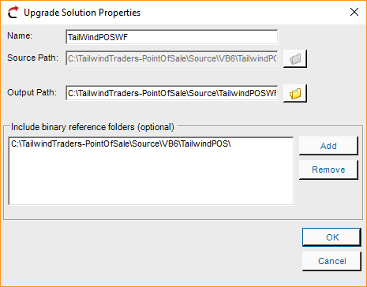

#### 2. Resolve References
Sometimes there might be some unresolved references that the VBUC can not resolve by itself, so they have to be set manually by right clicking it and selecting the option `Set Reference Manually`.

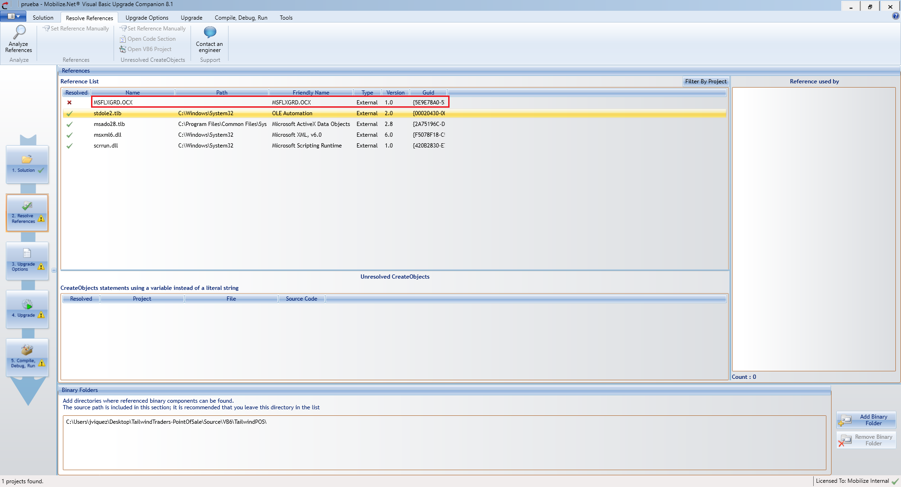

If you are having a hard time looking for unresolved references, take a look a our [TLB Github Repo](https://github.com/orellabac/TLBRepo.git). The reference you are looking for might be there.

#### 3. Upgrade Options

Choose the upgrade options for your project. This TailwindPOS demo uses the `MSXML2` library, so be sure to choose the option `COM Interop` before confirming the options if you want to keep using the same library in the migrated app.

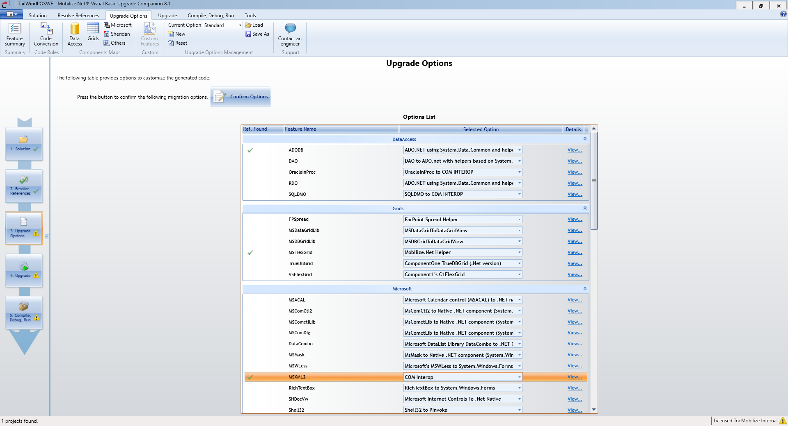

#### 4. Upgrade Process

Before starting the upgrade, choose the target `ASP.NET` framework version and choose how you want to include our code helpers in the migrated app, for this demo we use `.NET framework 4.7` and `Binary Helpers Integration` option.


Next, start the migration by clicking `Upgrade Projects` and wait for the process to end.

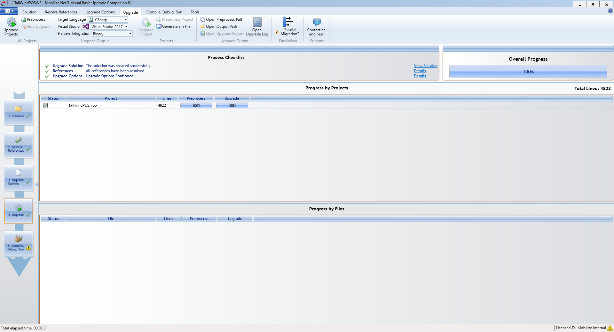

After the process ends, open your migrated solution and compile your app.

#### 5. Resolve migration conflicts

After you start your migrated app, a window will show you the next warning.

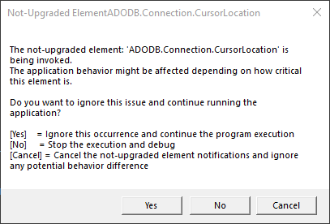

This means that VBUC could not migrate some code parts, this can happen for multiple reasons. In this demo, the line `conn.setCursorLocation(CursorLocationEnum.adUseClient);` is not needed anymore, but the migrator does not know that. To fix this warning just comment the code line in the `Main.cs` file.

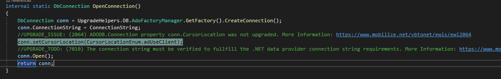

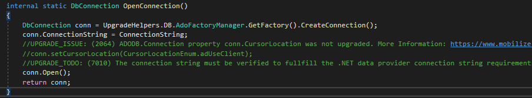

Finally, move the files `POS.mdb` and `TailwindPOS.ini` in the VB6 source directory of the TailwindPOS to the `bin` directory in the migration output directory. 

#### 6. Running the migrated app

Run the new WinForms version of TailwindPOS.

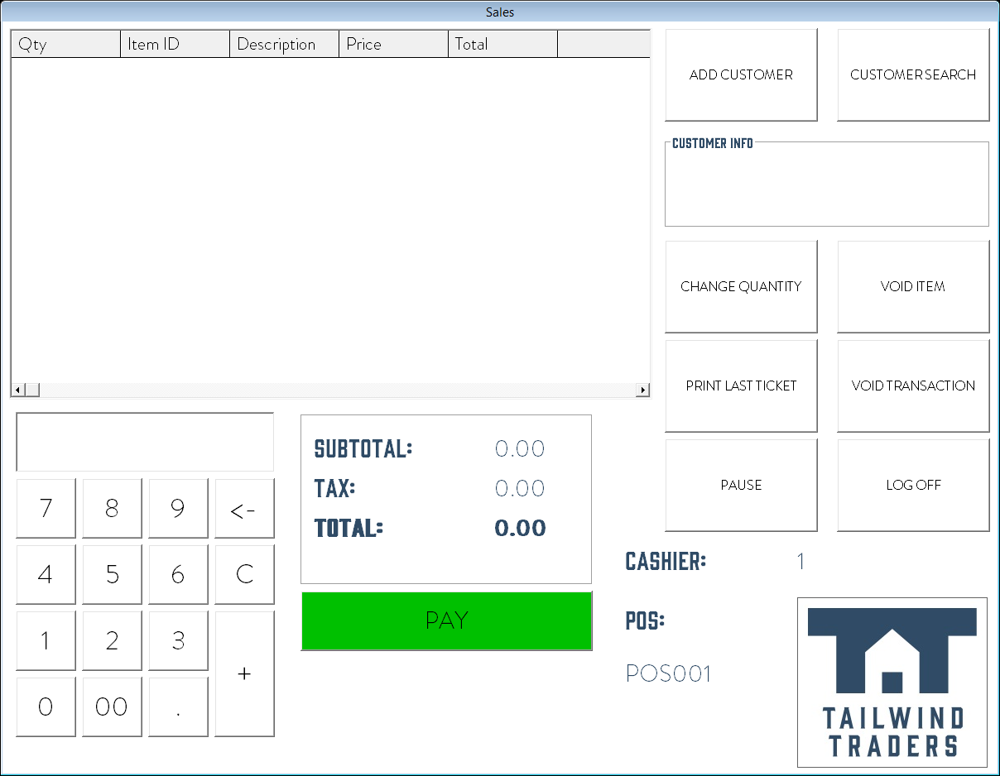

> NOTE: This application uses OLEDB to access MSACCESS. You can use OleDB on .NETCore 3.1 but some of the drivers are architecture specific. You can download the [Microsoft Access Database Engine 2010 Redistributable](https://www.microsoft.com/en-us/download/details.aspx?id=13255) for 32 or 64. If for example you install the 32 bit version then add:

```xml
  <PropertyGroup Condition="'$(Configuration)|$(Platform)'=='Debug|AnyCPU'">
    <Prefer32Bit>true</Prefer32Bit>
    <PlatformTarget>x86</PlatformTarget>
  </PropertyGroup>
```

## WinForms To Web

### WebMAP


WebMAP is a [Mobilize.net](https://www.mobilize.net/) product capable of migrating WinForms apps to .NET core and Angular. For more information about this product click [here](https://www.mobilize.net/webmap).

For support and sales you can email [Will Vasquez](mailto:wvasquez@mobilize.net).

#### Prerequisites
 
* Contact [Mobilize.net](https://www.mobilize.net/) to request a WebMAP license required in the migration process.
* Download and install [node.js](https://nodejs.org/en/download/). 
* Run the command  `npm install yarn` to install yarn.
* Install Angular by running the command `npm install -g @angular/cli`.

These steps are required to migrate and install dependencies of your migrated app.

#### 1.Migration process

Run the convertion tool using the following command.

```
./Mobilize.WFNetMAP.ConversionTool.exe -i <YourSolutionFile.sln> -o <output directory> -l <License Path>  --ByRefFeature "off" --UseProductionNugets
```

#### 2. Installing dependencies

First, add the new dependencies registry by running the following command.

```
npm config set registry https://www.myget.org/F/mobilizewebmap/auth/559d63b6-5f30-45eb-8acb-d5f7cb2858bc/npm/
```

After the registry was added, install the app Angular dependencies, go to the `tailwindpos-angular` folder located inside the migrated app directory and run the following command

```
yarn
```
This will automatically install all the required dependencies needed for the project. After the installation finished, run the following command to build the Angular application.

```
ng build
```

#### 4. Running the app

Before compiling and running the app, copy the files `POS.mdb` and `TailwindPOS.ini` to the migrated app root directory. After doing that just run your fresh new TailwindPOS web app.

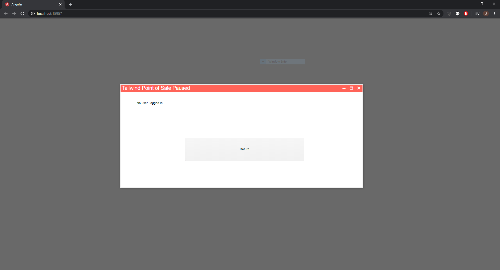

#### 5. Modifying styles

You can modify your app styles according to your preferences. In the directory `Documents/TailwindTradersBrandingResources` there is a modified `style.css` file, copy this file to `tailwindpos-angular\src` directory and recompile the app by running the command

```
ng build
```

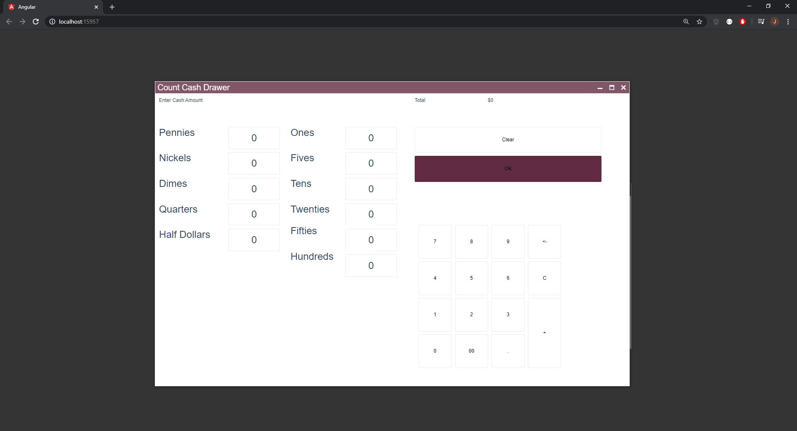

#### 6. Deployment to Microsoft Azure

Migrated web apps can be easily deployed to Azure cloud just follow the next steps.

#### 7. Migrate your Database - Access to SQL

A web application with a MS Access database?. It sounds like an outdated app, specially if you are looking to deploy the app into cloud. So before deploying your fresh new app, migrate the `POS.mdb` Access database to an instance of Microsoft SQL Server in Azure. For that your should first download and install [MS SQL Migration Assistant for Access (SSMA)](https://docs.microsoft.com/en-us/sql/ssma/access/installing-sql-server-migration-assistant-for-access-accesstosql?view=sql-server-ver15). Then follow the next steps.

1. Create a new SSMA project.
 
   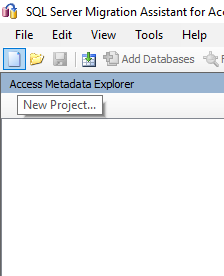

   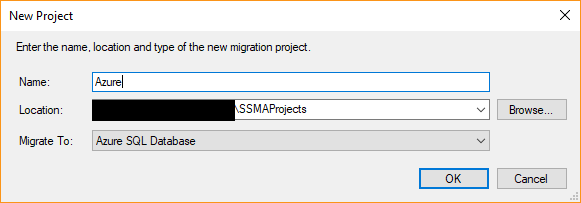

2. Connect to Access.
   
   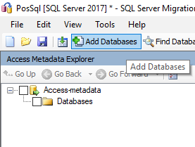

   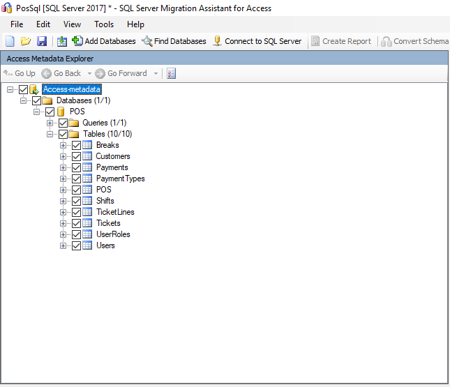

3. Connect to SQL server.


4. Start the migration.

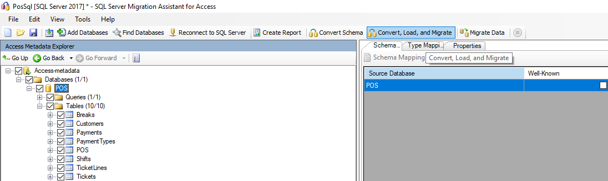

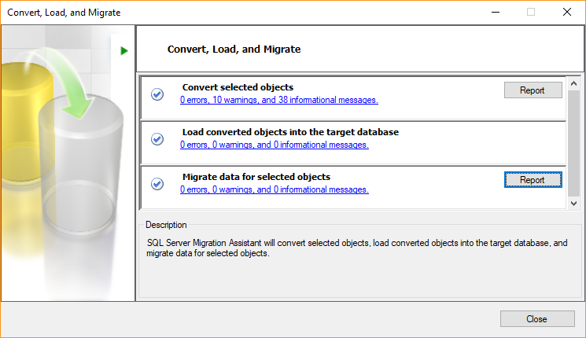

5. Check your migrated DB in your Azure portal.

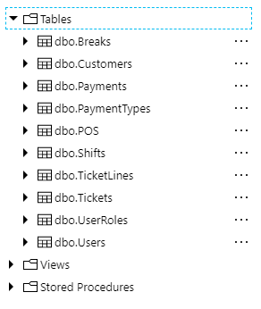

Before starting your Azure deployment, first go to the `App.config` file of the web app and change it to the following.

```xml
<?xml version="1.0" encoding="utf-8"?>
<configuration>
  <configSections>
    <section name="AdoFactories" type="UpgradeHelpers.DB.AdoFactoriesConfigurationSection, UpgradeHelpers.DB.Essentials" allowExeDefinition="MachineToApplication" allowLocation="true" />
    <section name="AdoIdentityColumns" type="UpgradeHelpers.DB.AdoIdentityColumnsConfigurationSection, UpgradeHelpers.DB.Essentials" allowExeDefinition="MachineToApplication" allowLocation="true" />
  </configSections>
  <connectionStrings>
  </connectionStrings>
  <AdoFactories>
    <!--
    
    The following section declares some of the most common factories. It can be modified in order to accomplish your needs.
	The factory declaration with the "isdefault" attribute set to true will be used by the upgraded application as the current provider factory.
    
    The database type attribute can take one of the following values
      * SQLServer: when the application interacts wiht Ms SQL Server
      * Oracle: when the application interacts wiht Oracle
      * Access: when the application interacts wiht Ms Access
      * Undefined: when none of the previous is being used
    
    -->
    <Factories>
      <add name="SQLServer" factorytype="System.Data.SqlClient" isdefault="true" databasetype="SQLServer" />
      <!-- MS SQL Server -->
      <add name="Oracle" factorytype="System.Data.OracleClient" isdefault="false" databasetype="Oracle" />
      <!-- Oracle -->
      <add name="Oledb" factorytype="System.Data.OleDb" isdefault="false" databasetype="Access" />
      <!-- Any database through Oledb -->
      <add name="ODBC" factorytype="System.Data.Odbc" isdefault="false" databasetype="Access" />
      <!-- Any database through ODBC -->
    </Factories>
  </AdoFactories>
  <AdoIdentityColumns>
  </AdoIdentityColumns>
</configuration>
```

Then change the connection string in the `TailwindPOS.ini` file.

```ini
[Connection String]
DatabaseConnectionString = Your SQL Server Connection String
```

> Note: Also include the `TailwindPOS.ini` file in the project and set its property `Copy to output directory` to `Copy Always`

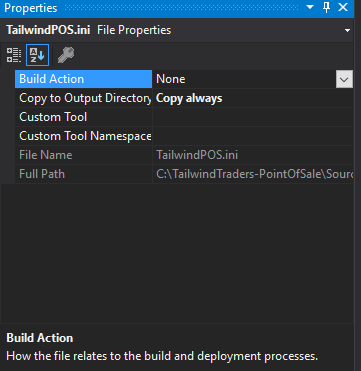

Finally publish and your application is now running in an Azure App Service.


# About Mobilize.net
Mobilize.Net accelerates and simplifies the transformation of software applications to .NET, web, mobile, and cloud platforms. Millions of developers have used Mobilize.Net technology to successfully modernize billions of lines of code. Mobilize.Net solutions enable customers to reduce risk, cost, and time while moving applications to the platforms businesses demand today. Mobilize.Net migration technology is Microsoft's chosen solution for Visual Studio and MSDN customers. The privately-held Mobilize.Net is based in Bellevue, WA, and is led by former Microsoft Corporate Vice President, Tom Button. For more information, please go to https://www.mobilize.net.

For support and sales you can email [Will Vasquez](mailto:wvasquez@mobilize.net).

[](https://www.mobilize.net)

# Contributing

This project welcomes contributions and suggestions.  Most contributions require you to agree to a
Contributor License Agreement (CLA) declaring that you have the right to, and actually do, grant us
the rights to use your contribution. For details, visit https://cla.opensource.microsoft.com.

When you submit a pull request, a CLA bot will automatically determine whether you need to provide
a CLA and decorate the PR appropriately (e.g., status check, comment). Simply follow the instructions
provided by the bot. You will only need to do this once across all repos using our CLA.

This project has adopted the [Microsoft Open Source Code of Conduct](https://opensource.microsoft.com/codeofconduct/).
For more information see the [Code of Conduct FAQ](https://opensource.microsoft.com/codeofconduct/faq/) or
contact [opencode@microsoft.com](mailto:opencode@microsoft.com) with any additional questions or comments.
