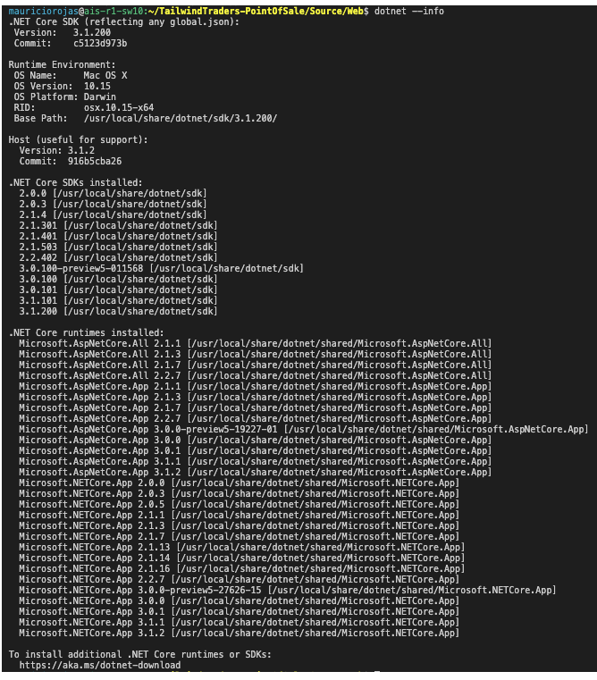

# Tailwind Point Of Sale

This is the Point Of Sale App modernized by Mobilize all the way from VB6 to .NET Core so it can run on Linux, Mac, Windows or Docker.


# Requisites

TailwindPOS is .NET Core 3.1. To build and run this app you need:
* Docker 
* .NET Core 3.1 https://dotnet.microsoft.com/download/dotnet-core/3.1
* .NET Core 2.2 https://dotnet.microsoft.com/download/dotnet-core/2.2 
* node.js https://nodejs.org/en/download/
* Yarn `npm install -g yarn`


> .NET Core 2.2 is used for the build process.


# Build BackEnd 


If you want to build locally you need to have .NET Core 3.1 and .NET Core 2.2

You can verify if your system is ready by running: `dotnet --info`.

If I run this on my laptop it will show an output like:



When you look at the output verify that under **`.NET Core runtimes installed`** you have `Microsoft.NETCore.App 2.2.x` your are good to go.

So just run:
```
dotnet build
dotnet run
```

You should see an output like:


# Building with Docker

Sometimes it is better to have Dockerimage. If you prefer to compile and run the app with Docker:

```
docker build -t orellabac:BuildTailwind .
docker run -d -p 5000:5000 --name myapp orellabac:BuildTailwind
```

# Build FrontEnd

The frontend only requires [nodejs](https://nodejs.org/en/download/) and yarn
```
cd tailwindpos-angular
yarn
ng build
```

# Setting up the Database

The Database files are in DockerDB (`POS.mdf` and `POS_log.ldf`), if your have SQL Server you can attach those files from SQL Server Management Studio.
If you setup the database in your our server you might need to change the Tailwind.ini file, adjusting the connection string.

There is also a docker file to run the database. 

## Building and running the docker image

```
cd DockerDB
docker build -t orellabac:POSDB .
docker run -p 1433:1433 orellabac:POSDB
```

# Run the Tailwind POS

Once the database is running. You can just run the backend and fronend.

If you run the frontend with `npm start` of `ng serve` it will be available at `http:\\localhost:4200`. 

And the backend after `dotnet run` will be available at `http:\\locahost:5000`.